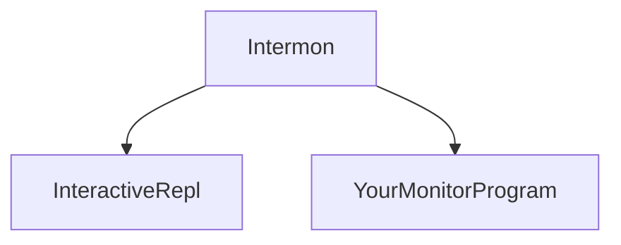

# Intermon

Intermon is an interactive supervisor for file monitor programs like `fswatch`, `entr` and `watchexec`.

Intermon is a pre-production prototype, written as an Elixir Script. 

Intermon reads YAML config files with the following items:

- Agent: A block that defines Monitor and Worker commands, and interactive options for each
- Monitor: A file change monitor program like `fswatch`, `entr` or `watchexec`.
- Worker: A worker program like `mix test`, etc.

## The File Change Monitor Landscape

There are several excellent file monitor programs.  These are typically used
during development to run tests automatically every time a source or test file
is saved.

### Independent vs Bundled

Many monitor programs are *bundled* as a language-specific project dependency.
(eg guard [ruby], mix_test_watch [elixir], jest [javascript])

Other monitor programs run *independent* of project and language. (eg
watchexec, entr, fswatch) Independent watchers can be used with any any
language, giving developers flexibity to use their favorite tool in a given
project.

### Interactive vs Static

Most monitor programs are *static* - they run the same test command every time
a file changes.

Some monitor programs are *interactive*, and allow you to dynamically change
which tests should be run with a few keystrokes.  For example, you may easily
switch between running all tests, stale tests, or failed tests.  Or you can run
only the tests whose filenames contain a substring.

Until now, interactive monitor programs are bundled as a project dependency (eg
mix_test_interactive [elixir], jest interactive [javacript]).  

### Independent, Interactive

Intermon is an interactive supervisor that works with any monitor program.
Intermon can be used independently across any language or project.

Intermon supervises two processes:

- a REPL that takes interactive commands from the terminal
- your watcher program - like `fswatch`, `entr` or `watchexec`

When the repl takes commands from the terminal, it restarts your watcher
program with updated options.

## Using 

TBD 

## Configuring

TBD 

## Related Projects

## Contributing

Issues and PRs welcome!

